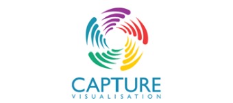
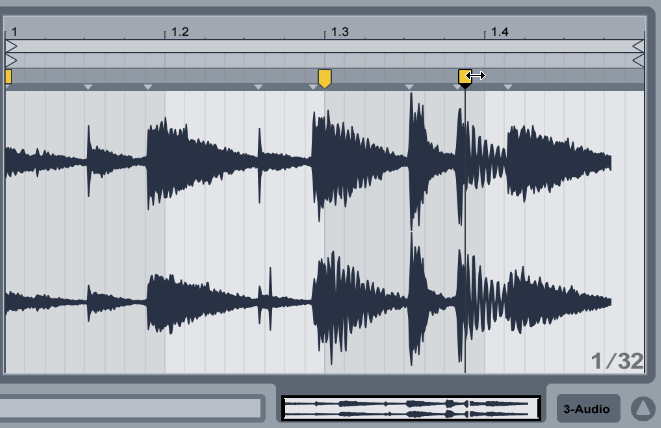

# PAC3: Manovich Reloaded  
**Autor:** [Oriol Partagàs Muñoz]  
**Llicència:** CC BY-SA 4.0  
**Assignatura:** Cultura Digital  
**Grau:** Multimedia  

## Introducció
En un món on els canvis es produeixen cada vegada més ràpidament, sovint ni tan sols som conscients de com els mitjans que utilitzem diàriament muten i transformen la nostra vida. Aquests no només evolucionen, sino que esdevenen altres mitjans, tal com van preveure Kay i Goldberg. Un d’aquests elements més presents en la nostra quotidianitat és l’ordinador que amb el pas del temps deixa de ser un mitjà per convertir-se en un metamedi, capaç de contenir una infinitat de mitjans que a la vegada s’hibriden per esdevenir altres mitjans que canviaran la lògica del programari.
Això ens indica que no s’acumulen com entitats diferents que simplement interactuen, sinó que es fusionen entre si per crear una nova unitat, un ecosistema inseparable on cada component es imprescindible per que la unitat tingui sentit.

Aquest estudi preten explorar dos casos on la hibridació del mitja s'ha convertit en un element imprescindible en la concepció contemporània del disseny d’il·luminació en referència programa Capture i en la producció de so pel que fa l'Ableton live.
  
   
  

   

  

    <small><i>
      
Logo Ableton Live (CC BY-SA 4.0)

    </i></small>
  

   

   

  

    <small><i>
      
Logo de Capture Visualisation. © Capture Visualisation AB.

      
Ús merament identificatiu.

    </i></small>
  

   

## Cas d'Hibridació 1: [Ableton Live] 

#### **CONTEXTUALITZACIÓ**

L'Ableton Live és un clar exemple, tal com menciona Manovich, de com el *"software ha passat a ser la capa invisible que impregna totes les etapes de la creació"*, en aquest cas de la producció musical. L'origen conceptual d'aquesta eina neix a Berlín als anys 2000, i es va crear amb la intenció de trencar la rigidesa dels estudis de gravació analògics i els seqüenciadors digitals. El fet que marca la diferència amb altres programes musicals és que, mitjançant la fusió de diferents tècniques de producció, ha esdevingut un híbrid de mitjans. Està dissenyat per ser alhora, un instrument en directe, un estudi de gravació amb capacitats per compondre, gravar arranjar i masteritzar, i una taula de mescles de DJ oferint les mateixes prestacions.

Gràcies a la nova estructuració i optimització del programari, l'estudi de gravació es redueix a un ordinador portàtil. Això permet que els processos de composició, mescla i interpretació en directe es puguin dur a terme tant en un escenari o a un entorn domèstic, obrint les portes a la democratització creativa en la producció musical. 
 
 
#### **HIBRIDACIÓ DE TÈCNIQUES**
El programa ofereix una composició musical basada en un muntatge no lineal, fet que la distingeix de la gran majoria de programes de producció musical tradicionals. És a dir, el programa ofereix una Vista de la Sessió (*Session Veiw*) on la música no es tracta com una línia en el temps fix, que es fracciona com una matriu de mòduls capaços de ser editats i llançats a temps real, barrejant fragments de forma indeterminada. A més aquesta interfície coexisteix simultàniament amb la Vista d'Arranjaments (*Arrangement View*) on l'usuari pot modificar i adaptar el aquests fragments en una línia temporal donant una coherència musical a la creació. 

  
   
  

   

  

    <small><i>
      
Imatge de l'espai d'arranjaments, on es pot modificar i adaptar els clips

     
*Arrangement View*

    </i></small>
  

   

   

  

    <small><i>
      
Area de Flux de treball no lineal.

      
*Session Veiw*

    </i></small>
  

   

D'altra banda un aspecte fonamental que integra el programa en un entorn d'hibridació, és la capacitat que té aquest per treballar en entorns MIDI. El mapeig de controladors físics que es sincronitzen de forma immediata amb el programari, demostra com l'entorn virtual del programa també s'hibrida amb l'entorn físic. 
 
 
#### **REMIXABILITAT PROFUNDA**
Un dels elements claus que permet manipular de forma estructural el concepte de la composició, separant diferents variables, però mantenint la coherència del resultat, és la funcionalitat del Warping. Tal com menciona Manovich en referència a la remixabilitat profunda, aquesta tècnica "té la capacitat de desmuntar, alterar i recombinar els elements interns i els pròpis llenguatges dels mitjans a un nivell atòmic." És capaç de separar la velocitat del so i la tonalitat en dues variables independents i que aquesta última no es vegi afectada permeten mescles de sons completament diferents hibridant-se perfectament en el mateix tempo i tonalitat. 

  
   
  

   

  

    <small><i>
      
Warping. L'espectre es dilata o contrau.

     
Modificant la velocitat però no la tonalitat del clip.

    </i></small>
  

   

D'altra banda l'eina Max for Live (M4L), permet modificar i programar els plugins que venen de fàbrica segons les necessitats de l'usuari. L'eina obre les portes a programar i crear els mateixos instruments, efectes d'audio i eines MIDI dins del mateix Ableton, fent que l'usuari sigui el mateix creador d'eines programant en la profunditat dels recursos del programari. 
 
 
#### NOVA GESTALT
Ableton Live, en l'era digital, esdevé una eina on la música es percep com la creació d'una obra complexa creada a partir de petits fragments digitals separats i modificats, establerts en un mitjà propi amb regles i objectes nous. Els clips fraccionats i aïllats, per si sols no estableixen una coherència musical, en ser llançats en la línia del temps dins de la graella musical esdevenen una unitat significativa que dona forma a l'obra final. En conjunt, aquest procés dona lloc a un nou llenguatge digital i a una nova manera de percebre la creació sonora, completament insubstituïble pels mitjans predecessors.
 
 
 
 
## Cas d'Hibridació 2: [Capture]
#### **CONTEXTUALITZACIÓ**
Capture, és un programari que actua com a pont entre l'espai escenogràfic tangible i l'espai virtual digital. Mitjançant l'algoritme som capaços de desmaterialitzar l'espai escènic i la llum per realitzar prototips de dissenys d'il·luminació abans de ser executats en un escenari real. Aquest fet canvia per complert el paradigma de del disseny de llums en el món de l'espectacle, permetent anticipar qualsevol planificació de muntatge de forma virtual.

El programari esdevé laboratori virtual en una *"capa invisible"*, que permet a tot un equip de disseny (escenografs, il·luminadors, tècnics i directors), creeï, programi i assagi un espectacle de gran format, molt abans de que la producció executiva entri en joc.
En aquest context, s'hibriden en un sol procés eines que abans funcionaven de forma separada: la planimetria 2D, el modelatge 3D, la programació d'il·luminació, la simulació virtual i documentació. Capture, es transforma així en un metamedi, tal com mencionaven Kay i Goldberg on tots els procesos s'integren un sol ecosistema digital que redefineix els mitjans físics originals.
  
   
  

   

  

    <small><i>
      
Capture espai de treball.

     
Es visualitzen les dos vistes de les capes de treball (2D - 3D modelatge virtualització)

    </i></small>
  

 

#### **HIBRIDACIÓ DE TÈCNIQUES**

Capture fusiona clarament tres tècniques imprescindibles en la creació d'il·luminacions provinent de tres disciplines originalment separades: la planimetria 2D i el modelatge 3D (propis de l'arquitectura i l'enginyeria), la programació d'il·luminació (vinculada a l'automatització i seqüenciació d'espectacles en viu) i la simulació física de la llum (relacionada amb la creació artística i la narrativa visual). Aquesta convergència crea un espai on la representació espacial, el control tècnic i la visualització artística no només conviuen, sinó que s’integren operativament.

En aquest context virtual una de les peculiaritats que l'integra com a mitja d'hibridació física-virtual és la seva capacitat de connectar una taula de llums física, de manera que els senyals DMX reals es tradueixen immediatament en comportaments lumínics dins del model 3D. Això permet que un mitjà físic extern controli en un entorn virtual en 3D, simulant amb precisió el que en un futur esdevindrà un espectacle en viu. Tanmateix, permet que tot un seguit de recursos que en un escenari operen de forma aïllada, puguin ser virtualitzats i sincronitzats en un sol entorn, aconseguint que diferents disciplines de l'espectacle en viu interactuïn en un sol ecosistema digital. 
 
 

]([https://youtube.com](https://www.youtube.com/watch?v=3-lpBDL17Eg))

 

    <small><i>
      
Video de Stage Management Company.

     
Demo creada amb Capture, d'un Show de llums sincronitzat amb la musica

    </i></small>
  

#### **REMIXABILITAT PROFUNDA**

Capture exemplifica la remixabilitat profunda descrita per Manovich perquè permet descompondre i manipular tots els elements d’un disseny lumínic a un nivell estructural. El programa no només ofereix un catàleg extens de projectors que esdeven objectes de forma modular amb paràmetres independents —color, intensitat, focus, gobo, moviment— que poden ser modificats, sinó que permet que les lleis de la física (com la reflexió o la dispersió en el fum) esdevinguin elements de programari manipulables de forma independent. 

Aquesta combinació crea un ecosistema viu i variable on la intervenció lumínica no és un afegit estètic, sinó una dada més que es recombina amb l'espai. Tanmateix, tot aquest ecosistema viu, pot mutar d'escenari de forma instantània; modificant la planta arquitectònica de la planigrafia, canviant al plànol d'un teatre a un altre i alhora imprimir el seu punt de vista tant en 2D com en 3D. Tal com menciona Manovich, La combinació d’aquests elements crea un ecosistema digital dinàmic on els components de l'entorn poden ser alterats i recombinats a "nivell atòmic". 
 
 
#### **NOVA GESTALT**

Finalment, Capture genera una nova gestalt en el disseny de la il·luminació escènica. L'experiència de l'usuari no és la suma d'elements separats (plànol 2D + model 3D + programació DMX), sinó una nova entitat on es realitza el projecte complet d'una il·luminació, trencant les  fronteres entre el disseny tècnic i la realitat visual per esdevenir un projecte tècnic i artístic únic. 

Tal com menciona Manovich, aquesta hibridació crea un llenguatge propi on la simulació és el resultat d'un procés integrat, possible gràcies al fet que el "software ha passat a ser la capa invisible que impregna totes les etapes de la creació". El resultat és una hibridada en un metamitja on l'il·luminador pot treballar amb una sola "caixa d'eines digital" que anteriorment requerien mitjans separats i desconnectats entre si.

## CONCLUSIONS

## BIBLIOGRAFIA 
- Adell, Ferran. (2024). Remediació, multimèdia i hibridació. [Recurs d'aprenentatge]. UOC.
- Manovich, Lev. (2013). El software toma el mando. Editorial UOC.
- Kay, A., & Goldberg, A. (1977). Personal Dynamic Media. IEEE Computer.
- Justicia, Juan. (2014). Coneixement obert i tecnologia. [Recurs d'aprenentatge]. UOC.

## MANUALS DE REFERENCIA
- Ableton AG. (s.f.). Ableton Live Reference Manual. Recuperat de https://www.ableton.com/en/manual/welcome-to-live/
- Capture Visualisation AB. (s.f.). Capture Reference Manual. Recuperat de https://www.capture.se/Support/Documentation
